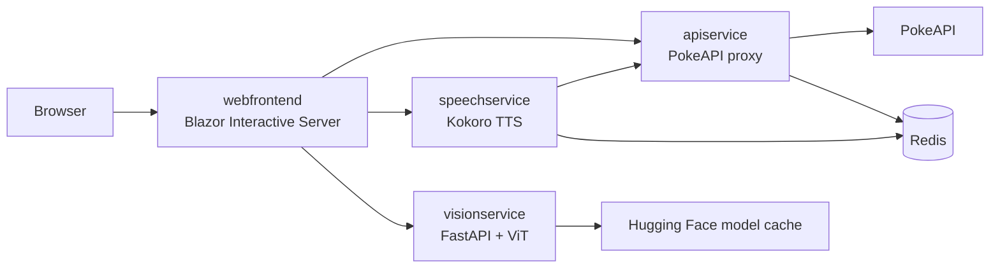

# Pokedex Aspire

A distributed Pokedex built with .NET Aspire, Blazor Interactive Server, PokeAPI, local neural speech synthesis, and local Pokemon image classification.

The application can browse Pokemon data, inspect moves, abilities, encounters, species, and evolutions, identify a Pokemon from a webcam or uploaded image, and play a spoken Pokedex briefing.

## Features

- Responsive Pokedex-style Blazor UI
- Pokemon lookup by National Pokedex ID
- Animated default, back, and shiny sprites
- Species research, encounter locations, moves, and characteristics
- Ability details with standard and hidden slot indicators
- Clickable evolution chains that load the selected Pokemon
- Latest Pokemon cry from PokeAPI
- Local Sarah voice narration with separate overview and species recordings
- Webcam capture and image upload for Pokemon identification
- Top-three classifier results with explicit user confirmation
- Redis caching for PokeAPI responses and generated WAV files
- Aspire health checks, service discovery, logs, traces, and resource orchestration

## Architecture



| Resource | Technology | Responsibility |
| --- | --- | --- |
| `pokedex-aspire.AppHost` | .NET Aspire | Resource graph and local orchestration |
| `pokedex-aspire.Web` | Blazor Interactive Server | Pokedex UI and same-origin service proxies |
| `pokedex-aspire.ApiService` | ASP.NET Core Minimal API | Cached PokeAPI access |
| `pokedex-aspire.SpeechService` | ASP.NET Core + KokoroSharp | Local Sarah voice WAV generation |
| `pokedex-aspire.VisionService` | Python + FastAPI + Transformers | Local Pokemon image classification |
| `pokedex-aspire.ServiceDefaults` | .NET | Health checks, service discovery, resilience, and OpenTelemetry |
| `pokedex-aspire.Tests` | NUnit + Aspire testing | Distributed integration and narration tests |
| `cache` | Redis | API response and generated speech cache |

## Prerequisites

- .NET 10 SDK
- Aspire CLI 13.5 or newer
- Docker or another Aspire-compatible container runtime for Redis
- [`uv`](https://docs.astral.sh/uv/) for the Python vision service
- Internet access on the first run to download model weights and query PokeAPI
- A secure browser context and camera permission for webcam capture

Verified development versions:

```text
.NET SDK: 10.0.111
Aspire CLI: 13.5.3
uv: 0.12.10
Python: 3.12, managed by uv
```

Install `uv` on Linux or macOS if needed:

```sh
curl -LsSf https://astral.sh/uv/install.sh | sh
```

## Run Locally

From the repository root:

```sh
dotnet restore
aspire run
```

Aspire creates the Python virtual environment, restores `uv.lock`, starts Redis, and launches all services. Open the `webfrontend` URL shown in the Aspire dashboard.

Useful lifecycle commands:

```sh
aspire ps
aspire wait webfrontend
aspire logs visionservice
aspire logs speechservice
aspire stop
```

### First-Run Model Downloads

The AI models are downloaded lazily and stored outside the repository:

| Model | Trigger | Approximate size | Linux cache location |
| --- | --- | ---: | --- |
| Kokoro 82M | First `Read entry` request | 326 MB | `~/.local/share/pokedex-aspire/models/kokoro.onnx` |
| Pokemon ViT classifier | Scanner initialization or `/vision/warmup` | 331 MB | `~/.local/share/pokedex-aspire/models/huggingface` |

The scanner displays `Model warming` until the classifier is ready. The rest of the Pokedex remains usable during warm-up.

## Speech Pipeline

One **Read entry** action plays three clips in order:

1. Latest Pokemon cry from PokeAPI
2. Pokemon overview generated by Sarah (`af_sarah`)
3. Species research generated by Sarah

The two generated recordings have independent endpoints and Redis cache entries:

```text
GET /speech/pokemon/{id}/overview-v1
GET /speech/pokemon/{id}/species-v1
```

The browser starts the cry immediately, preloads the overview, and then preloads species research while the overview plays. Missing cries are skipped automatically. **Stop** cancels and resets all queued audio.

Generated WAV files are cached in Redis for 30 days. They are not written as individual files to the repository. The current Redis resource has no persistent volume, so recordings are regenerated if the Redis container is recreated.

## Pokemon Scanner

The scanner supports:

- Explicit webcam permission with the rear camera preferred
- Still-image capture rather than continuous video upload
- JPEG, PNG, and WebP file upload fallback
- Browser-side center crop and JPEG compression
- 5 MB server-side upload limit
- Top-three predictions and confidence values
- Confirmation before changing the selected Pokemon
- Automatic camera-track cleanup after capture or component disposal

The classifier is pinned to:

```text
imzynoxprince/pokemons-image-classifier-gen1-gen9
revision: 78fccd021ff34aff277f85e8066ed6a01aee2488
```

It currently runs on CPU. Warm inference on official artwork is typically around 200-300 ms on the verified development machine.

The model is closed-set and always attempts a Pokemon classification. The UI disables results below 15% confidence, rejects the model's accidental `.ipynb_checkpoints` class, and leaves event-only classes without a PokeAPI link. Results should still be treated as suggestions, especially for physical cards, toys, drawings, or cluttered webcam scenes.

Vision endpoints exposed through the Web app:

```text
GET  /vision/ready
POST /vision/warmup
POST /vision/identify
```

## PokeAPI Endpoints

`apiservice` proxies and caches these resources:

```text
GET /pokemon/{id}
GET /pokemon/{id}/encounters
GET /pokemon-species/{id}
GET /evolution-chain/{id}
GET /move/{name}
GET /ability/{name}
GET /characteristic
GET /characteristic/{id}
```

## Build And Test

Build the .NET solution:

```sh
dotnet build pokedex-aspire.sln
```

Run the distributed .NET tests:

```sh
dotnet test pokedex-aspire.Tests/pokedex-aspire.Tests.csproj
```

Run the Python vision-service tests:

```sh
pushd pokedex-aspire.VisionService
uv run python -m unittest discover -s tests -v
popd
```

The Python tests cover API validation and class-to-PokeAPI mapping without loading the classifier weights. Real model inference is validated separately with an image through `/vision/identify`.

## Automation

GitHub Actions keeps routine pull-request checks lightweight while exercising the local AI models separately:

- **CI** restores the locked `uv` environment, runs the Python tests, builds the .NET solution, and runs the Aspire distributed tests on pull requests and pushes to `main`. It does not download model weights.
- **Dependency Review** rejects pull requests that introduce dependencies with moderate-or-higher known vulnerabilities.
- **CodeQL** analyzes C# and Python changes on pull requests, pushes to `main`, and a weekly schedule.
- **AI Model Smoke** runs weekly or on demand. It caches both model directories, classifies a generated Pikachu-like fixture, validates the pinned classifier revision, synthesizes a WAV with Kokoro, and verifies the Redis speech-cache hit.
- **Dependabot** checks NuGet, `uv`, and GitHub Actions weekly. Minor and patch updates are grouped; major updates remain separate.

## Configuration

### Speech

Override the Kokoro model path with the standard ASP.NET Core configuration key:

```text
Speech__Kokoro__ModelPath=/path/to/kokoro.onnx
```

The current package is `KokoroSharp.CPU`. Moving to `KokoroSharp.GPU.Linux` also requires a CUDA 12 toolkit, cuDNN, and CUDA-enabled ONNX session configuration in `speechservice`.

### Vision

`AppHost.cs` configures:

```text
VISION_DEVICE=cpu
UVICORN_WORKERS=1
HF_HOME=<local application data>/pokedex-aspire/models/huggingface
```

Use a single Uvicorn worker because each worker would otherwise load another copy of the model into memory.

## Troubleshooting

### Scanner remains on `Model warming`

Check readiness and logs:

```sh
curl -sS https://webfrontend-pokedex-aspire.dev.localhost:7016/vision/ready
aspire logs visionservice
```

The exact frontend port can vary. Prefer the URL shown by `aspire ps` or the Aspire dashboard.

### Camera is unavailable

- Grant camera permission to the site.
- Use HTTPS or localhost; `getUserMedia` requires a secure context.
- Use **Choose image** when the browser or machine has no camera.

### Speech generation is slow

The first request loads the Kokoro model. Uncached recordings take several seconds on CPU; Redis-backed requests normally return in milliseconds. The response header `X-Speech-Cache` reports `MISS` or `HIT` on direct `speechservice` requests.

## Third-Party Data And Models

- [PokeAPI](https://pokeapi.co/) supplies Pokemon data, sprites, and cries.
- [KokoroSharp](https://github.com/Lyrcaxis/KokoroSharp) is MIT licensed; Kokoro model weights and voices are Apache-2.0.
- [Pokemon classifier](https://huggingface.co/imzynoxprince/pokemons-image-classifier-gen1-gen9) is Apache-2.0.

Pokemon and related names are trademarks of their respective owners. This repository is an independent development project and is not affiliated with or endorsed by The Pokemon Company.

